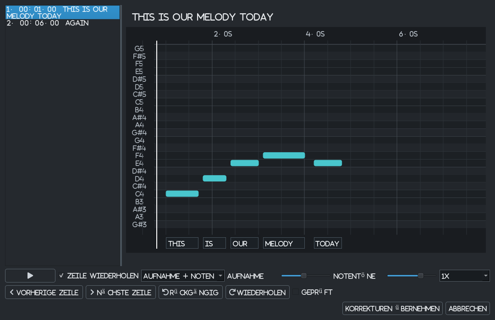
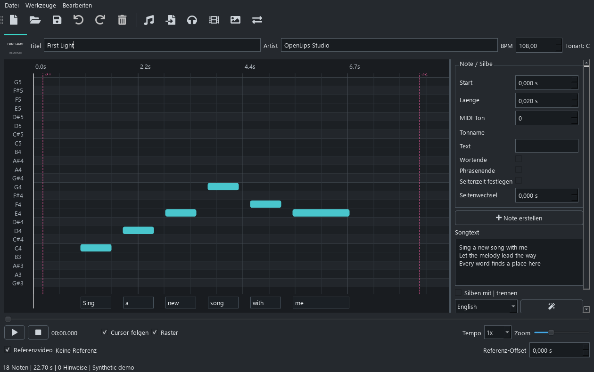
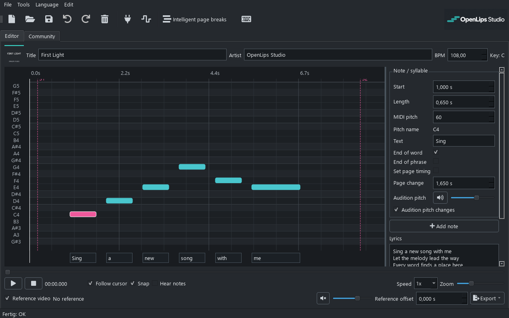
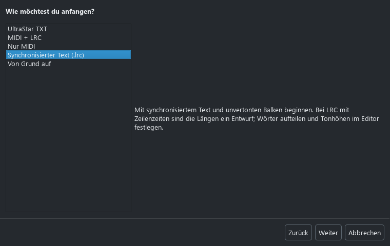
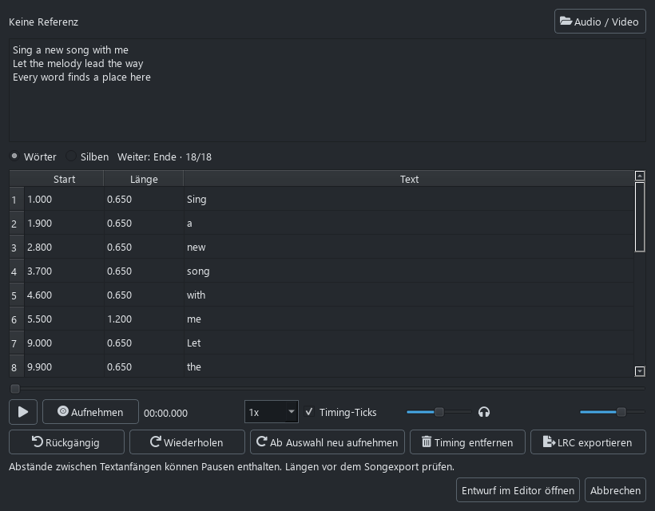
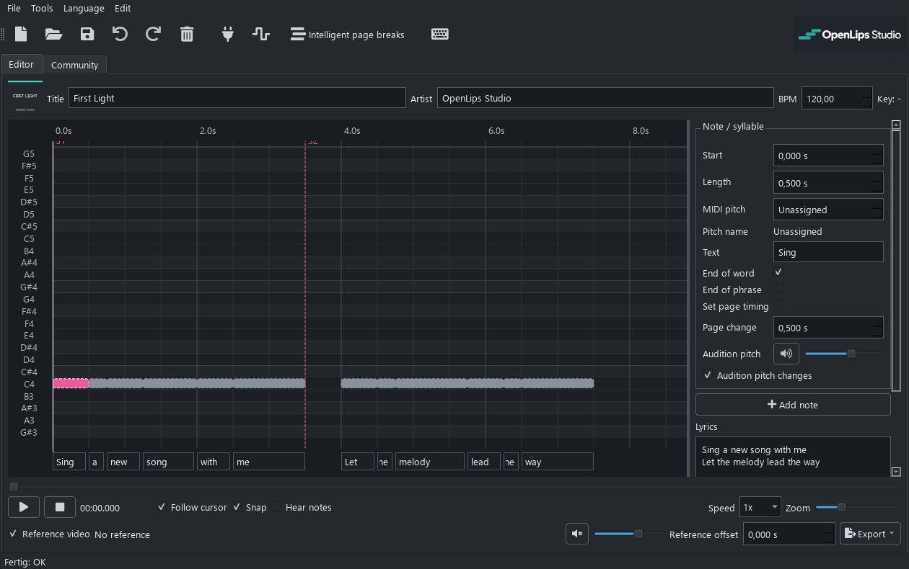
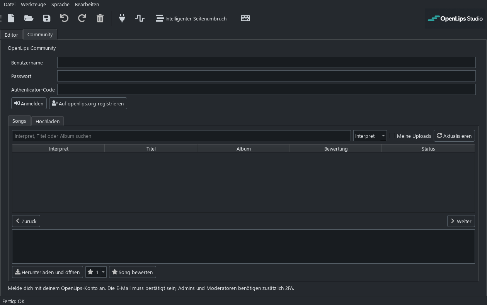
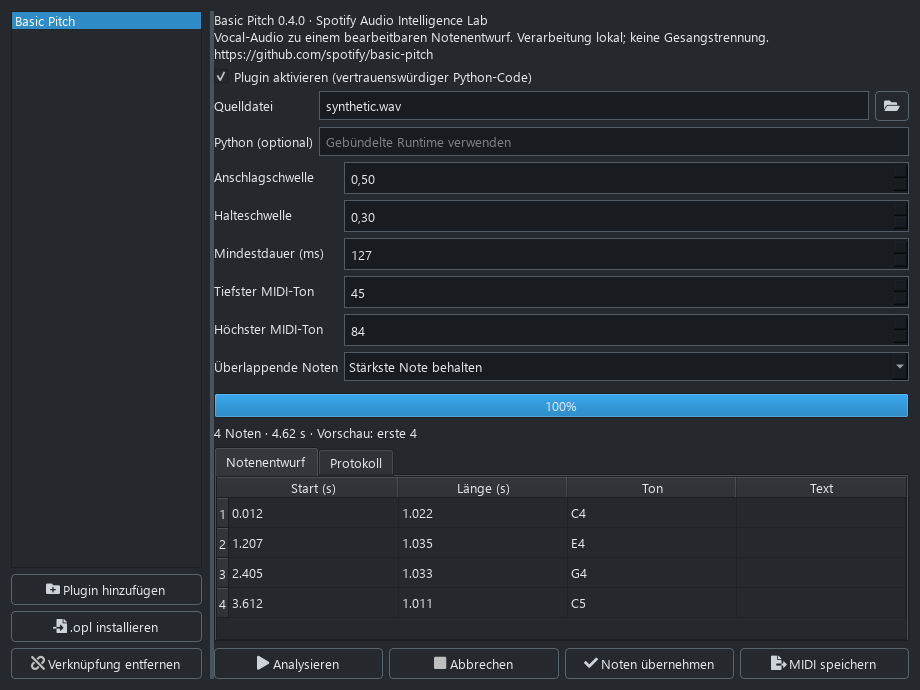

[English](README.md) | [Deutsch](README.de.md)

KI- und Basic-Pitch-Entwürfe lassen sich vor der Übernahme zeilenweise prüfen:
Aufnahme und Notentöne in Schleife hören, getrennt in der Lautstärke regeln,
langsamer abspielen und die Noten direkt bearbeiten. Änderungen sind rückgängig
machbar; Abbrechen lässt das Original unverändert. Die Ansicht ist auch unter
**Werkzeuge > Charts > Entwurf prüfen** erreichbar. Zeilengetimte KI-Eingaben
können mit deutscher oder englischer Wortausrichtung verarbeitet werden.
Vorhandene Wort-Zeitstempel bleiben erhalten. Basic Pitch nutzt vorhandene Anker,
ohne fehlende Wort-Zeitstempel zu erfinden. Ein Apple-Music-Abo ist nicht nötig.

# OpenLips

**Du wolltest schon immer deine eigenen Songs in Lips importieren? Selbst wenn nicht: Jetzt kannst du es zumindest ausprobieren.**

OpenLips ist ein unabhängiges Community-Projekt, das neue Songs in das Xbox-360-Karaokespiel *Lips* bringen möchte. **OpenLips Studio** ist das Programm dafür: einen Chart importieren, Noten und Songtext bearbeiten und einzelne Songs oder ganze Song-Packs für das Spiel vorbereiten. Als Ausgangspunkt können UltraStar, MIDI, zeitlich zugeordnete Lyrics oder eine Aufnahme dienen. Du kannst aber auch einen eigenen Chart von Grund auf erstellen.

Das Ganze befindet sich **noch in einer frühen Entwicklungsphase**. Es gibt eine funktionierende Grundlage, aber vieles ist noch unvollständig, experimentell oder muss gründlicher getestet werden.

> **Inoffiziell und unabhängig.** OpenLips steht in keiner Verbindung zu Microsoft, Xbox oder iNiS. Für die Nutzung und Weitergabe deines Materials brauchst du die nötigen Rechte. Mehr dazu unter [Rechte und Verantwortung](#unabhängigkeit-rechte-und-verantwortung).

## Warum es dieses Projekt gibt

Ich bin Gerrit. Als ich jünger war, habe ich Lips oft mit Freunden gespielt. Seit Jahren wünsche ich mir, unsere eigenen Songs ins Spiel bringen zu können. Irgendwann wollte ich herausfinden, ob aus diesem Wunsch tatsächlich etwas werden kann.

Inzwischen sind viele Stunden, Tage und Monate in das Verstehen der Dateien, in Tests, Irrwege und neue Versuche geflossen. Der entscheidende Schritt war, eigene Chart- und Lyric-Dateien von Grund auf zu erzeugen, die das originale Lips von 2008 im Test laden und abspielen konnte. Zum ersten Mal in diesem Projekt gibt es damit nicht nur ein funktionierendes Ergebnis, sondern auch eine Dokumentation, die den Weg dorthin nachvollziehbar macht.

Ursprünglich habe ich eine Ausbildung zum Informationselektroniker gemacht, also in einem IT-nahen Bereich. Später habe ich den Beruf gewechselt und arbeite heute als Lokführer. Die Begeisterung für Computer, Server und Systeme ist geblieben, ebenso wie viel praktische Erfahrung damit. Programmieren habe ich dagegen nie grundlegend gelernt. Neben meinem Hauptberuf fehlt mir die Zeit, damit ganz von vorn anzufangen. KI-gestützte Entwicklung hat mir die Möglichkeit gegeben, aus einer Idee, die immer liegen geblieben ist, ein echtes Projekt zu machen.

Als Lokführer kenne ich die Sorge vor Automatisierung selbst. Ich habe durchaus Bammel davor, irgendwann durch einen Computer ersetzt zu werden oder nur noch daneben zu sitzen, während der Zug von allein fährt. Die Sorgen von Entwicklern darüber, was KI für ihren Beruf bedeuten könnte, sind für mich deshalb keine abstrakte Diskussion. Auch ihre Bedenken zur Qualität solcher Software kann ich nachvollziehen. Ihre Erfahrung wird dadurch für mich nicht überflüssig. Dieses Projekt baut darauf auf. Und es geht hier auch nicht darum, einmal „mach alles, aber bitte ohne Fehler“ in einen Chat zu schreiben: Dahinter stecken viel Recherche, praktische Tests, Fehlersuche und Dokumentation. Fehler müssen trotzdem gefunden und behoben werden.

Genau deshalb möchte ich das Projekt jetzt öffnen. Aus OpenLips soll mehr werden als mein persönliches Experiment. Wenn du dich für Lips, Karaoke, Reverse Engineering oder nützliche Werkzeuge begeisterst, bist du herzlich eingeladen, mitzumachen.

## Mach mit

Etwas funktioniert nicht? Bitte [melde es](https://github.com/gerrit117/OpenLips-Studio/issues). Beschreibe, was du versucht hast, was passiert ist, welche Version du verwendet hast und möglichst auch, wie sich der Fehler nachstellen lässt. Lade bitte keine urheberrechtlich geschützten Songs oder originalen Spieldateien in öffentliche Fehlerberichte hoch.

Ideen, Korrekturen an der Dokumentation, Tests auf anderen Systemen und [Pull Requests](https://github.com/gerrit117/OpenLips-Studio/pulls) sind genauso willkommen. Du musst nicht programmieren können, um etwas beizutragen. Gerade in dieser frühen Phase ist Rückmeldung keine Störung, sondern die Grundlage dafür, dass das Projekt besser wird.

## Roadmap

Das sind Vorhaben, keine Zusagen für das nächste Release. Die ersten Schwerpunkte sind:

- [x] Eine aktivierbare Plugin-Verwaltung mit `.opl`-Paketen, Einstellungen, Vorschau und Import im Hintergrund einbauen.
- [ ] Das Songformat tiefergehend dokumentieren, einschließlich LS2 und späterer Veröffentlichungen.
- [ ] Quick-Time-Events (QTEs) und weitere songbezogene Spielaktionen unterstützen.
- [ ] Die Community-Webseite veröffentlichen: **Coming soon**, mit Benutzerkonten und einer gemeinsamen Datenbank für selbst erstellte Charts und Lyrics, mit den nötigen Nutzungsrechten und Moderationsregeln.
- [x] Spotifys [Basic Pitch](https://github.com/spotify/basic-pitch) einbinden: Gesang in einen MIDI- und Notenentwurf umwandeln, der geprüft und bearbeitet werden kann.
- [ ] Die Plugin-Schnittstelle um weitere Verarbeitungs- und Exportabläufe erweitern.
- [x] Eigene DLCs und Song-Packs für eine kompatible Xbox-Umgebung exportieren; in Number One Hits auf einer modifizierten Xbox 360 von Nutzern getestet.
- [ ] Die DLC-Erkennung in Xenia klären und weitere Spielversionen testen.
- [x] Medienvorbereitung, Vorschauen und Paketerstellung im Windows-Export zusammenführen.
- [ ] Eine gleichwertige Medienkonvertierung für macOS und Linux ergänzen.
- [ ] Einen optionalen FTP-Upload für eine kompatible Xbox-Umgebung ergänzen.
- [ ] Bedienbarkeit, Übersetzungen, Barrierefreiheit und Tests im Alltag verbessern.

Mit „LS2“ sind hier die Lips-Veröffentlichungen nach dem ersten Spiel von 2008 gemeint. Ihre Song- und DLC-Strukturen müssen trotzdem einzeln geprüft werden; wir gehen nicht davon aus, dass alle identisch sind.

Einige Grundlagen sind bereits vorhanden:

- [x] UltraStar-Charts und MIDI-Melodien importieren.
- [x] Mit LRC ohne MIDI beginnen oder das Timing des Songtexts mit der Leertaste aufnehmen.
- [x] Noten, Silben und Phrasengrenzen in einem grafischen Editor bearbeiten.
- [x] Unfertige Arbeit als `.olp`-Projekt speichern.
- [x] Neue Chart- und Lyric-Dateien für das originale Lips ohne Songvorlage erzeugen.
- [x] Native Beta-Downloads für Windows, macOS und Linux bereitstellen.

## Was Studio heute schon kann

- **Importieren oder selbst erstellen.** UltraStar-TXT-Dateien einlesen, eine Melodiespur aus einer MIDI-Datei auswählen oder eigene Noten hinzufügen. Beim UltraStar-Import bleiben das Timing und die Silben erhalten.
- **Eine Sammlung importieren.** Mehrere UltraStar-Dateien oder Songordner samt Medien und Covern einlesen. Den Speicherort der Projekte auswählen oder direkt ein Song-Pack exportieren. Die Seitenaufteilung wird automatisch verbessert, ohne die musikalischen Noten zu verändern.
- **Platz für den Text schaffen.** Beim einzelnen UltraStar-Import bleiben die ursprünglichen Umbrüche erhalten. Den intelligenten Seitenumbruch anwenden, eigene Wechsel während der Wiedergabe mit der Leertaste aufnehmen oder die Aufteilung beim Batch-Import und Song-Pack-Export automatisch erledigen lassen. Ausdrücklich manuell bearbeitete Aufteilungen bleiben erhalten; ganze Wörter und Melismen bleiben zusammen.
- **Mit zeitlich zugeordneten Lyrics beginnen.** „Nur LRC“ erzeugt graue Textbalken, ohne eine Melodie zu erfinden. Tonhöhen selbst zuweisen, Längen anpassen, eine Zeile versuchsweise in Wörter oder ein Wort in mehrere Töne aufteilen. Unfertige Entwürfe lassen sich speichern und später weiterbearbeiten.
- **Das Text-Timing aufnehmen.** Keine LRC vorhanden? Songtext in den Timing-Assistenten einfügen und während der Wiedergabe die Leertaste drücken. Wörter oder ausdrücklich getrennte Silben wählen, mit Tick-Tönen gegenhören, einzelne Einträge korrigieren oder ab dort neu aufnehmen. Referenzaudio und Ticks haben getrennte Lautstärkeregler. Ein KI-Modell ist dafür nicht nötig.
- **Mit einer Aufnahme anfangen.** Basic Pitch in der Plugin-Verwaltung aktivieren, eine Audiodatei auswählen und Erkennungsschwellen, Notendauer sowie Tonumfang einstellen. Den lokal erzeugten Entwurf prüfen, als MIDI speichern oder die Noten in den Editor übernehmen. Die Analyse lässt sich abbrechen; die Notenübernahme lässt sich rückgängig machen. Eine isolierte Gesangsspur eignet sich besser als ein vollständiger Mix. Gesangstrennung und Songtexterkennung übernimmt das Plugin nicht.
- **Den Chart bearbeiten.** Noten erstellen, löschen, verschieben und an beiden Rändern kürzen oder verlängern, Tonhöhen anpassen und verbundene Melismen hinzufügen. Eine Dur-/Moll-Tonart liefert Skalenmarkierungen und passende Tonvorschläge. Änderungen lassen sich rückgängig machen, im Timing-Assistenten mit Sprung zur betreffenden Wortzeit.
- **Textzuordnung und fehlende Angaben korrigieren.** Ab einer ausgewählten Note und markierten Textstelle neu zuordnen, ohne von vorn zu beginnen. Fehlende Texte oder Tonhöhen werden mit Notennummer und Zeitposition aufgelistet; ein Klick führt zur Korrektur.
- **Einen Entwurf aus Audio erstellen.** Die optionale lokale KI-Analyse kann Gesang trennen, Tonhöhen erkennen und Wörter zuordnen. Das Ergebnis bleibt bearbeitbar und muss geprüft werden. Fehlende KI-Komponenten werden bei Bedarf heruntergeladen; unterstützte AMD-Grafikkarten können die Windows-ROCm-Engine nutzen.
- **Synchronisierte Songtexte behalten.** LRC-Dateien und synchronisierte LRCLIB-Ergebnisse importieren, Zeilen- und Wort-Zeitmarken prüfen und im Projekt speichern. Enhanced LRC und, nach der Tonhöhenzuweisung, MIDI exportieren. Normale LRC enthält Zeilenanfänge, keine exakten Wortlängen; Timing und Melodie müssen weiterhin geprüft werden.
- **Lyrics schon vor dem Projekt suchen.** Bei „Nur LRC“ und „MIDI + LRC“ im Assistenten eine vorhandene Datei öffnen oder online bei LRCLIB suchen. Die Werkzeuge sind nach Charts, Lyrics, Medien und Bibliothek/Xbox geordnet.
- **Das Timing prüfen.** Referenzaudio oder ein Video zusammen mit dem Chart abspielen. Die Wiedergabegeschwindigkeit ändern, hineinzoomen und bei Bedarf alle Noten samt Seitenwechseln zeitlich verschieben.
- **Den Zwischenstand speichern.** Mit einem `.olp`-Projekt kannst du einen Song unfertig lassen und später daran weiterarbeiten. Verknüpfte Medien bleiben separate Dateien.
- **Die Darstellung vorbereiten.** Ein Cover auswählen oder ein einfaches Cover erzeugen lassen. Unter Windows wandelt der DLC-Export das ausgewählte Video oder Audio um und erzeugt vollständiges xWMA-Audio sowie eine 15-Sekunden-Vorschau ab dem ersten Texteinsatz. Songs mit Video erhalten zusätzlich ein kleines Vorschauvideo für das Menü. Medienwerkzeuge und STFS-Backend sind enthalten.
- **Die Tonhöhe prüfen.** Ausgewählte Noten mit einem Referenzton abhören oder die Notentöne während der Wiedergabe einschalten. Fehlende optionale KI-Komponenten werden beim ersten Einsatz automatisch heruntergeladen und geprüft.
- **Exportieren und ausprobieren.** Einen medienfreien `.ols`-Community-Song oder ein DLC-Paket speichern. Eigene DLCs wurden im Nutzertest von Number One Hits auf einer modifizierten Xbox 360 erkannt und abgespielt. Die DLC-Erkennung in Xenia wird weiterhin untersucht.
- **Songs bündeln und übertragen.** Gespeicherte Projekte als benanntes Song-Pack exportieren oder ein geprüftes DLC direkt auf einen Xbox-USB-Stick mit sichtbarem `Content`-Ordner kopieren. Aktuelle Grenzen und Teststand stehen im [Pack- und USB-Leitfaden](docs/song_packs_usb.md).
- **Versionen unterscheiden.** Die lokale Bibliothek zeigt Speicher-/Erstellungsdatum, unfertige Projekte und den neuesten gespeicherten Songstand. Die USB-Ansicht listet echte Pack-/Songnamen und vergleicht Pakete mit der lokalen Bibliothek. Genre, Jahr und Album werden übernommen, wenn die Vorlage sie enthält.
- **Community: Coming soon.** Studio hat bereits einen vorbereiteten Reiter für Anmeldung, Suche, Bewertungen, Kommentare und `.ols`-Uploads/-Downloads. Die Webseite ist noch nicht öffentlich verfügbar; die Online-Funktionen öffnen mit ihrer Veröffentlichung.

*Der Editor mit einem kleinen, selbst erstellten Demo-Chart.*

*Für jede Note lassen sich Timing, Tonhöhe und Textzuordnung bearbeiten.*

*Mit einem Chart, MIDI, zeitlich zugeordneten Lyrics oder einer eigenen Aufnahme beginnen.*

*Der Timing-Assistent mit selbst erstellten Demo-Lyrics und bearbeitbaren Zeitmarken.*

*Graue Balken zeigen Text-Timing, keine automatisch erkannte Melodie.*

*Der vorbereitete Community-Reiter. Die öffentliche Veröffentlichung steht noch aus.*

*Das erste Plugin mit einer selbst erzeugten Aufnahme aus vier Testtönen, nicht mit einem Song.*

### Neu in 0.4.0 Beta

„Nur LRC“ und der Timing-Assistent ermöglichen den Einstieg ohne MIDI. Batch-Import und Song-Pack-Export optimieren die Seiten jetzt automatisch. Seitenwechsel lassen sich auch während der Wiedergabe aufnehmen. Das Bearbeiten von Tonhöhe oder Text rundet unveränderte Notenzeiten nicht mehr; Entwürfe ohne Tonhöhen können nicht versehentlich als DLC-Melodie exportiert werden. Mehr dazu im [englischen Changelog](CHANGELOG.md) und im [Leitfaden zum Arbeiten mit Lyrics](docs/lyric_first_workflow.md).

### Was noch nicht fertig ist

Getestet wurden das originale Lips von 2008 in Xenia und eigene DLCs in Number One Hits auf einer modifizierten Xbox 360. Damit ist nicht jede Veröffentlichung oder jeder Spielmodus bestätigt. Die Spielaktionen der Originalsongs werden noch nicht vollständig unterstützt. Unsignierte Inhalte lassen sich mit diesem Tool nicht auf einer unveränderten Xbox 360 installieren.

Der Windows-DLC-Export umfasst Medienkonvertierung, Audioextraktion, Vorschauen und Paketerstellung. Bearbeitung und Chartexport sind auch unter macOS und Linux verfügbar; dort werden vorerst kompatible Spielmedien benötigt. Die Community-Webseite wird privat getestet. Wenn etwas nicht klappt, melde es bitte, statt davon auszugehen, dass du etwas falsch gemacht hast.

### Medien unter macOS und Linux

**Für den Spieleexport müssen Audio und gegebenenfalls Video vorerst bereits im kompatiblen Format vorliegen.** MP3-/MP4-Dateien lassen sich im Editor als Referenz verwenden, werden auf diesen Systemen aber nicht automatisch in Lips-Medien umgewandelt.

Das getestete Videoprofil für das erste Spiel ist **ASF `.wmv`, VC-1 Advanced (WVC1), 768 × 432 bei 24000/1001 fps**, mit **WMA-Pro-Audio, 48 kHz, Stereo, 16 Bit und 192 kbit/s**. Separates OG-Audio verwendet ASF/WMA Pro in `.wma`. Die experimentelle DLC-Verpackung benötigt dagegen **RIFF/XWMA für Vollaudio und Vorschau**; das Umbenennen einer `.wma` konvertiert sie nicht. Video ist optional. Originaldateien enthalten außerdem WMV3-Video und WMA-Standard-/xWMA-Audio, aber diese Beobachtungen bestätigen nicht jede neu codierte Datei.

Die [genauen Medienanforderungen und Vorbereitungsschritte](docs/studio_media.md#deutsch-medien-vorbereiten) erläutern auch die Header-Vorgaben und den Unterschied zwischen getesteten Einstellungen und der 720p-Obergrenze.

## Download

Die aktuelle Beta findest du unter **[GitHub Releases](https://github.com/gerrit117/OpenLips-Studio/releases)**. Für Windows gibt es einen Installer und ein portables Archiv. macOS auf Apple Silicon und Intel sowie Linux haben eigene native Builds. Achte auf die Versionsnummer der einzelnen Dateien: Diese Builds können später fertig werden als die Windows-Veröffentlichung.

Die eingebaute, optionale KI-Analyse erstellt bearbeitbare Chart-Entwürfe aus Audio: Gesang trennen, Tonhöhen erkennen und Wörter zuordnen. Bitte prüfe das Ergebnis sorgfältig; die Texterkennung macht bei Gesang noch deutliche Fehler. Das kleine Tonhöhenmodell ist enthalten, die große KI-Engine wird separat angeboten. Eine exakte automatische Silbenerkennung ist noch nicht fertig.

Entpacke das vollständige Studio-Archiv und lass die enthaltenen Dateien zusammen. Python ist enthalten. Basic Pitch ist ein separater, optionaler **`.opl`**-Download für deine Plattform und wird über die Plugin-Verwaltung installiert. Das Paket enthält sein eigenes Modell und die Analyseumgebung. Eine zusätzliche Python-Installation, ein Spotify-Konto oder ein API-Schlüssel sind nicht nötig. Die Audiodatei wird lokal verarbeitet und nicht hochgeladen. Weitere Informationen stehen im [Plugin-Katalog](plugins/README.md), der [Editor-Anleitung](docs/studio.md), der [Plugin-Entwicklerdokumentation](docs/studio_plugins.md) und den [Plattformhinweisen](docs/studio_platforms.md). Die technische Dokumentation ist derzeit überwiegend auf Englisch.

Für Windows gibt es zusätzlich einen Installationsassistenten, für macOS ein DMG mit einer Verknüpfung zu „Programme“. Optionale KI-Komponenten werden beim ersten Einsatz automatisch heruntergeladen und geprüft, mit Fortschrittsanzeige und Abbruchmöglichkeit. Größere Modelle bleiben im lokalen Zwischenspeicher. Unterstützte AMD-Radeon-Grafikkarten können die separate Windows-ROCm-Engine nutzen; CPU-Verarbeitung bleibt möglich. Die [Testergebnisse und bekannten Grenzen](docs/ai_song_creation_test_report.md) sind dokumentiert.

## Dokumentation

Die technischen Informationen liegen in [`docs/`](docs/). Gute Einstiegspunkte sind:

- [Den Editor verwenden](docs/studio.md).
- [Nur LRC und den Timing-Assistenten verwenden](docs/lyric_first_workflow.md).
- [Medien, Cover und Synchronisierung](docs/studio_media.md).
- [Aufbau der Songdateien](docs/structures.md) und der [strukturelle Reader](docs/og_ixb_reader.md).
- [Seitenwechsel und Projekte](docs/studio_pages_and_community.md).
- [Community-Anmeldung, Downloads und Uploads](docs/studio_community.md).
- [Optionale Bibliothek, Xbox-Übertragung und fensterloser LAN-Helfer](docs/xbox_library_server.de.md) (lokaler Entwicklungsstand, noch nicht veröffentlicht).
- [Docker-Bibliothek mit WebUI und Remote-Zugriff aus Studio](library_server/README.de.md) (lokaler Entwicklungsstand).
- [Recherche und Kommandozeilenwerkzeuge](docs/research_overview.md).

Die Recherche hält sowohl Erkenntnisse als auch offene Fragen fest. Ein Format lesen zu können bedeutet noch nicht, jede Variante davon sicher schreiben zu können.

## Danke

Ohne Menschen, die ihr Handwerk gelernt, diese Werkzeuge entwickelt und ihre Arbeit geteilt haben, könnte ich dieses Projekt nicht umsetzen. Ihre Zeit und ihr Wissen verdienen Anerkennung, gerade bei einem Projekt wie diesem.

Die App und ihre Entwicklungswerkzeuge bauen auf [Python](https://www.python.org/), [Qt for Python](https://doc.qt.io/qtforpython-6/), [Mido](https://github.com/mido/mido), [Pyphen](https://github.com/Kozea/Pyphen), [QtAwesome](https://github.com/spyder-ide/qtawesome) und [PyInstaller](https://pyinstaller.org/) auf. [LRCLIB](https://lrclib.net/) ermöglicht die optionale Lyrics-Suche; [FFmpeg](https://ffmpeg.org/) hilft bei der optionalen Medienvorbereitung.

Für Recherche und Tests waren auch [Xenia](https://github.com/xenia-project/xenia), [Xenia Canary](https://github.com/xenia-canary/xenia-canary), [Ghidra](https://github.com/NationalSecurityAgency/ghidra) und [XEXLoaderWV](https://github.com/zeroKilo/XEXLoaderWV) wichtig. Der experimentelle Paket-Builder verwendet [Velocity](https://github.com/hetelek/Velocity) und [Botan](https://botan.randombit.net/). Nicht alle diese Werkzeuge sind im App-Download enthalten.

Danke auch an alle, die einen Build testen, Fehler melden, Erkenntnisse teilen oder anderen beim Einstieg helfen. Die Lizenzen und Hinweise zu Abhängigkeiten stehen in [THIRD_PARTY_NOTICES.md](THIRD_PARTY_NOTICES.md).

Ein besonderes Dankeschön geht an **Spotifys Audio Intelligence Lab und die Entwickler von [Basic Pitch](https://github.com/spotify/basic-pitch)**, die ihr Transkriptionsmodell und den Quellcode als Open Source bereitstellen. Das erste integrierte Studio-Plugin nutzt ihre Arbeit über [ONNX Runtime](https://github.com/microsoft/onnxruntime). Die Einbindung ist unabhängig und weder ein Spotify-Dienst noch eine offizielle Unterstützung durch Spotify.

Die eingebaute Audio-Chart-Funktion wurde durch [UltraSinger](https://github.com/rakuri255/UltraSinger) und [UltraSinger Studio](https://github.com/lazinessss999-dot/UltraSinger_studio-v1.0) inspiriert. Danke an ihre Entwickler und an die Teams hinter [Demucs](https://github.com/facebookresearch/demucs), [Whisper](https://github.com/openai/whisper), [faster-whisper](https://github.com/SYSTRAN/faster-whisper) und [SwiftF0](https://github.com/lars76/swift-f0). Die Einbindungen arbeiten lokal und sind keine offiziellen Dienste dieser Projekte.

Danke auch an **Markus Böhning und die Mitwirkenden von [USDB Syncer](https://github.com/bohning/usdb_syncer)** sowie an das [yt-dlp](https://github.com/yt-dlp/yt-dlp)-Team. Das optionale USDB-Downloader-Plugin bietet eine Suche und Stapeldownloads direkt in Studio, einschließlich Covern. Studio enthält außerdem einen manuellen Mediendownload. Lade und teile nur Material, für dessen Nutzung du die erforderlichen Rechte hast.

## Unabhängigkeit, Rechte und Verantwortung

**OpenLips und OpenLips Studio sind unabhängige, inoffizielle Projekte. Sie stehen in keiner Verbindung zu Microsoft, Xbox, iNiS, den Entwicklern oder Herausgebern von Lips oder anderen Rechteinhabern und werden von diesen weder unterstützt noch gesponsert.** Produkt- und Firmennamen dienen lediglich dazu, die betreffenden Spiele und Werkzeuge zu benennen. Die jeweiligen Rechte verbleiben bei ihren Inhabern.

**Du bist selbst dafür verantwortlich, dein Ausgangsmaterial rechtmäßig zu beschaffen und zu verwenden.** Das betrifft Spieldateien, Musikaufnahmen, Videos, Coverbilder, Songtexte und musikalische Transkriptionen. Auch Charts und Lyrics ohne beigefügte Aufnahme können urheberrechtlich geschützt sein. Die Software verschafft dir keine zusätzlichen Rechte an Songs oder Spielinhalten. Der Besitz einer Aufnahme allein gibt dir keine Weiterverbreitungsrechte.

OpenLips ist keine Bezugsquelle für Spieldateien oder kommerziell veröffentlichte Songs. Die Softwarelizenz des Projekts gilt nicht für importierte Inhalte. Teile bitte nur Inhalte, für deren Weitergabe du die nötigen Rechte besitzt, und beachte die Gesetze, die für dich gelten.

Der Quellcode des Projekts steht unter [GPL-3.0-or-later](LICENSE).
