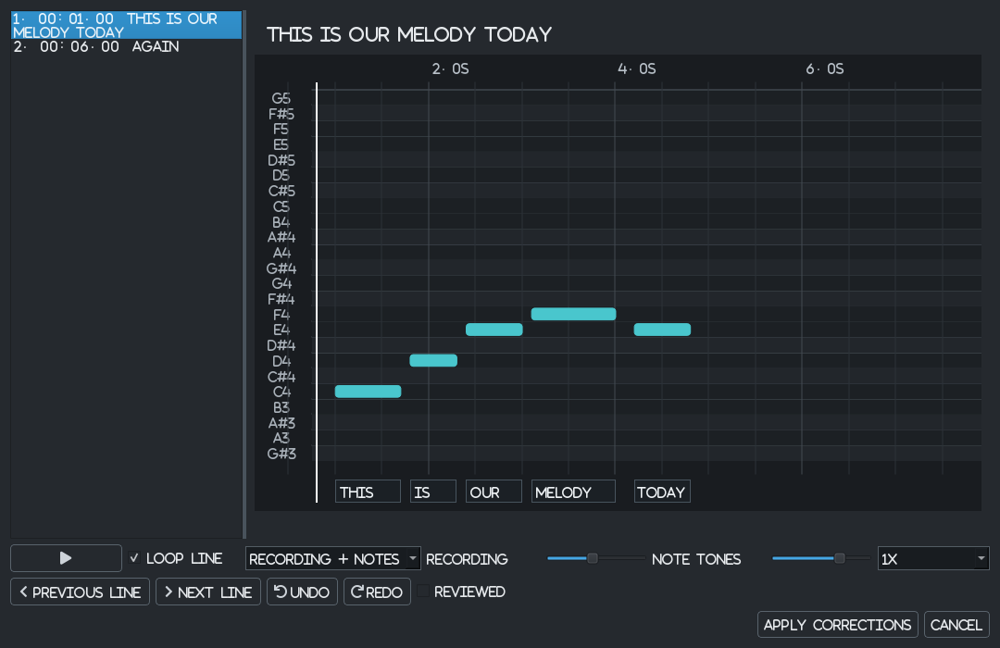
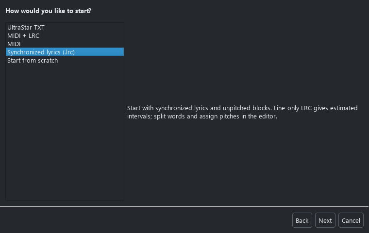
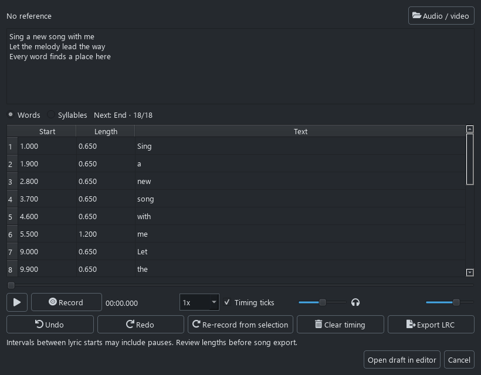
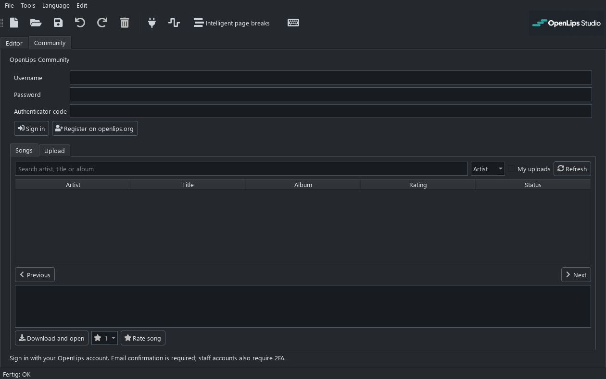

[English](README.md) | [Deutsch](README.de.md)

# OpenLips

**Ever wanted to add your own songs to Lips? Even if you haven't, now you can give it a try.**

OpenLips is an independent community project about bringing new songs to the Xbox 360 karaoke game *Lips*. **OpenLips Studio** takes you from an UltraStar chart, MIDI melody, timed lyrics or recording to an editable song and a DLC package. Adjust notes and lyrics, check them against your audio or video, and export a single song or a named song pack. You can also start with an empty chart.

This is **early-stage development**, not a finished product. There is a working foundation, but plenty is still incomplete, experimental or waiting for more testing.

> **Unofficial and independent.** OpenLips has no affiliation with Microsoft, Xbox or iNiS. You must have the necessary rights to use and share your material. See [rights and responsibility](#independence-rights-and-responsibility).

## Why this exists

I'm Gerrit. I played Lips with friends when I was younger, and for years I've wanted to bring our own songs into it. Eventually, I decided to find out whether that wish could become something real.

Many hours, days and months went into understanding the files, testing ideas, getting things wrong and trying again. The breakthrough was reaching a point where our own chart and lyric files could be created from scratch, then loaded and played by the original Lips (2008) in testing. For the first time in this project, we have both a working result and documentation explaining how we got there.

I originally completed vocational training in information electronics, an IT-related field. I later changed careers and now work as a train driver. My enthusiasm for computers, servers and systems has stayed with me, along with plenty of practical experience. Programming is the part I never properly learned, and my full-time job leaves little room to start from the ground up. AI-assisted development has made it possible for me to turn an idea that kept sitting on the shelf into a project I can actually work on.

As a train driver, I worry about automation too. The thought of being replaced by a computer someday, or just sitting there watching the train drive itself, makes me uneasy. So developers' concerns about what AI might mean for their profession aren't some abstract issue to me. I also understand their concerns about software quality. I don't see their knowledge as replaceable. This project depends on it. Nor is this a one-prompt “make no mistakes” project: there is a lot of research, hands-on testing, debugging and documentation behind it, and mistakes still need to be found and fixed.

That's also why I want to open it up now. I'd love for OpenLips to become more than my personal experiment. If you care about Lips, karaoke, reverse engineering or making useful tools, you're welcome here.

## Help shape it

AI and Basic Pitch drafts now open a line-by-line review before adoption. With
timed lyrics, each line becomes a review segment: loop the recording and note
tones, adjust their volumes separately, slow playback and edit notes directly.
Corrections can be undone or cancelled without changing the original project.
Reopen this view at **Tools > Charts > Review draft**. German/English word
alignment is available for line-timed AI input; existing word-timed LRC files
keep their supplied anchors. Basic Pitch uses supplied anchors without inventing
missing word timestamps. No Apple Music subscription is needed.

Something doesn't work? Please [report it](https://github.com/gerrit117/OpenLips-Studio/issues). Tell us what you tried, what happened, which version you used and, if possible, how to reproduce it. Please don't attach copyrighted songs or original game files to public reports.

Ideas, corrections to the documentation, testing on other systems and [pull requests](https://github.com/gerrit117/OpenLips-Studio/pulls) are all welcome. You don't need to write code to contribute. Early feedback is how this project gets better, not an interruption to its development.

## Roadmap

These are plans, not promises about the next release. The first priorities are:

- [x] Add an opt-in plugin manager with `.opl` packages, settings, previews and background import workflows.
- [ ] Document the song format more deeply, including LS2 and later releases.
- [ ] Support quick-time events (QTEs) and other song-specific gameplay actions.
- [ ] Launch the community website: **coming soon**, with accounts and a shared database of user-created charts and lyrics, subject to the necessary rights and moderation.
- [x] Integrate Spotify's [Basic Pitch](https://github.com/spotify/basic-pitch): turn vocal audio into a MIDI and note draft that can be reviewed and edited.
- [ ] Expand the plugin API to additional processing and export workflows.
- [x] Export playable custom DLC and song packs for a compatible Xbox setup; tested by users in Number One Hits on a modified Xbox 360.
- [ ] Resolve DLC discovery in Xenia and expand testing across game editions.
- [x] Combine media preparation, previews and DLC packaging in the Windows export workflow.
- [ ] Add equivalent media conversion on macOS and Linux.
- [ ] Add optional FTP transfer to a compatible Xbox setup.
- [ ] Improve usability, translations, accessibility and real-world testing.

“LS2” is used here as shorthand for Lips releases after the original 2008 game. Their song and DLC layouts still need to be checked individually; they are not assumed to be identical.

Some foundations are already in place:

- [x] Import UltraStar charts and MIDI melodies.
- [x] Create a melody from LRC-only lyric blocks or record lyric timing with Space.
- [x] Edit notes, syllables and phrase boundaries in a graphical editor.
- [x] Save unfinished work as an `.olp` project.
- [x] Generate new chart and lyric files for the original Lips, without a song template.
- [x] Provide native Windows, macOS and Linux beta downloads.

## What Studio can do today

- **Import or create.** Bring in UltraStar TXT files, choose a melody track from a MIDI file, or add notes yourself. UltraStar timing and syllables are preserved on import.
- **Import a collection.** Batch-import UltraStar files or song folders with their media and covers. Choose where to save the projects or proceed directly to song-pack export. Page layout is improved automatically, without changing the musical notes.
- **Make room for lyrics.** A single UltraStar import keeps its source breaks. Apply Intelligent Page Breaks, record your own switches with Space during playback, or let batch import and song-pack export handle the layout. Explicit manual layouts stay intact; whole words and melismas stay together.
- **Start with timed lyrics.** Choose LRC only to create grey lyric blocks without inventing pitches. Assign the melody yourself, adjust durations, split a line into estimated word blocks or split a word across several pitches. Save an unfinished draft and return to it later.
- **Record lyric timing.** No LRC? Paste the words into the Timing Assistant and tap Space during playback. Choose words or explicitly divided syllables, listen back with timing ticks, correct a fragment or re-record from it. Reference audio and ticks have separate volume controls. No AI model is needed.
- **Start from a recording.** Enable Basic Pitch in the plugin manager, choose an audio file and adjust detection sensitivity, note duration and pitch limits. Review the locally generated draft, save it as MIDI or take its notes into the editor. The analysis can be cancelled; replacing notes can be undone. Isolated vocals work better than a full mix. This is not automatic vocal separation or lyric transcription.
- **Work on the chart.** Create, delete, move or resize either note edge, change pitch, assign lyric fragments and add linked melisma segments. Choose a major/minor key for scale guides and suggested pitches. Undo and redo are available, including timestamp navigation in the Timing Assistant.
- **Repair lyrics and incomplete notes.** Reassign from a selected chart note and marked text position without starting over. Missing text or pitches are listed with note numbers and times, with a direct jump to the correction.
- **Create a draft from audio.** Optional local vocal separation, pitch detection and lyric recognition produce an editable chart. Review the result before using it: singing recognition still makes substantial mistakes. Small-model pitch analysis is bundled; the heavier AI engine is a separate download.
- **Keep synchronized lyrics.** Import LRC files and synchronized LRCLIB results, preview line/word timestamps and save them with the project. Export enhanced LRC and, once pitches are assigned, MIDI. Ordinary LRC gives line starts, not exact word lengths; timing and melody still need review.
- **Find lyrics before creating a project.** The LRC and MIDI + LRC wizard choices offer an existing file or an online LRCLIB search. Tools are grouped into Charts, Lyrics, Media and Library/Xbox.
- **Check the timing.** Play reference audio or video alongside the chart. Adjust playback speed, zoom in and shift notes and page changes together when the chart needs a timing correction.
- **Check the pitch.** Audition selected notes with a reference tone or enable note tones during playback. Missing optional AI components are downloaded and verified automatically on first use.
- **Save your progress.** An `.olp` project lets you leave a song unfinished and return to it later. Referenced media stays separate.
- **Prepare the presentation.** Choose a cover or generate a simple one. On Windows, DLC export converts the selected video or audio and creates full xWMA audio plus a 15-second preview starting at the first lyric. Video songs also get a small menu preview video. The media tools and STFS backend are included.
- **Export and experiment.** Save a media-free `.ols` Community song or a DLC package. Custom DLC has been recognized and played in Number One Hits on a modified Xbox 360 in user testing; DLC discovery in Xenia remains under investigation.
- **Group songs and transfer them.** Export a named song pack from saved projects, or copy a verified DLC directly to an Xbox USB drive with a visible `Content` folder. See the [pack and USB guide](docs/song_packs_usb.md) for current limits and testing status.
- **Track your versions.** The local library shows save/build dates, unfinished projects and the latest saved song version. Xbox USB storage lists real pack/song names and compares packages with the local library. Source genre, year and album are retained where available.
- **Community: coming soon.** Studio already has a tab prepared for sign-in, browsing, ratings, comments and `.ols` uploads/downloads. The website is not publicly available yet; these online features will open with its launch.

*The editor with a small original demo chart.*

*Each note has editable timing, pitch and lyric settings.*

*Start with a chart, MIDI, timed lyrics or your own recording.*

*The Timing Assistant with original demo lyrics and editable timestamps.*

*Grey blocks are lyric timing, not an automatically detected melody.*

*The prepared Community tab. Public launch is still ahead.*

*The first plugin, using an original four-tone test recording rather than a song.*

### New in 0.4.0 Beta

LRC-only creation and the Timing Assistant make it possible to start without MIDI. Batch imports and song packs now optimize pages automatically. You can also record page changes during playback. Pitch or lyric edits no longer round untouched note timings, and unpitched drafts cannot accidentally become DLC melody. See the [English changelog](CHANGELOG.md) and [lyric-first guide](docs/lyric_first_workflow.md).

### What is not ready yet

Testing covers the original Lips (2008) through Xenia and custom DLC in Number One Hits on a modified Xbox 360. This does not establish compatibility with every release or gameplay mode. Original song events are not fully supported, and unsigned content cannot be installed on an unmodified Xbox 360 through this tool.

Windows DLC export includes media conversion, audio extraction, previews and package creation. Editing and chart export are available on macOS and Linux too, but those systems still need compatible game media. The community website is being tested privately. If a feature fails, please report it rather than assuming you've done something wrong.

### Media on macOS and Linux

**For now, game export requires already-compatible audio and, if used, video.** MP3/MP4 files can be used as editor references, but are not automatically converted to Lips media on these systems.

The tested original-game video profile is **ASF `.wmv`, VC-1 Advanced (WVC1), 768 × 432 at 24000/1001 fps**, with **48 kHz stereo, 16-bit WMA Pro audio at 192 kbit/s**. Separate OG `.wma` audio uses ASF/WMA Pro. Experimental DLC packaging instead requires **RIFF/XWMA full audio and preview**; renaming `.wma` is not conversion. Video is optional. Original files also contain WMV3 video and WMA Standard/xWMA audio, but those observations do not validate every newly encoded file.

See the [exact media requirements and preparation steps](docs/studio_media.md#already-compatible-media-on-macos-and-linux), including header requirements and the distinction between tested settings and the 720p limit.

## Download

Get the latest beta from **[GitHub Releases](https://github.com/gerrit117/OpenLips-Studio/releases)**. Windows has an installer and a portable archive. macOS on Apple Silicon and Intel, and Linux have separate native builds; check the version on each asset, as they may finish later than the Windows release.

Extract the complete Studio archive and keep its files together. Python is included. Basic Pitch is a separate, optional **`.opl`** download for your platform; install it in the plugin manager. Its package includes its own model and analysis runtime, without a separate Python installation, Spotify account or API key. Audio is processed locally, not uploaded. See the [plugin catalog](plugins/README.md), [editor guide](docs/studio.md), [plugin developer guide](docs/studio_plugins.md) and [platform notes](docs/studio_platforms.md).

Windows also has an installer; macOS has a DMG with an Applications shortcut. Optional AI components are downloaded and verified when first needed, with progress and cancellation. Larger models remain in your local cache. Supported AMD Radeon GPUs can use the separate Windows ROCm engine; CPU processing remains available. See the [AI workflow and measured limitations](docs/ai_song_creation_test_report.md).

## Documentation

The technical material lives in [`docs/`](docs/). Start with:

- [Using the editor](docs/studio.md).
- [LRC-only creation and the Timing Assistant](docs/lyric_first_workflow.md).
- [Media, covers and synchronization](docs/studio_media.md).
- [Song-file structures](docs/structures.md) and the [structural reader](docs/og_ixb_reader.md).
- [Page timing and projects](docs/studio_pages_and_community.md).
- [Community sign-in, downloads and uploads](docs/studio_community.md).
- [Optional library, Copy to Xbox and headless LAN worker](docs/xbox_library_server.md) (local development build; not yet published).
- [Self-hosted Docker library and Studio remote access](library_server/README.md) (local development build).
- [Research and command-line tools](docs/research_overview.md).

The research records both findings and open questions. Reading a format is not the same as safely writing every variant of it.

## Thank you

I couldn't build this without people who learned their craft, wrote these tools and shared their work. Their time and expertise deserve credit, especially in a project like this one.

The app and its development tools rely on [Python](https://www.python.org/), [Qt for Python](https://doc.qt.io/qtforpython-6/), [Mido](https://github.com/mido/mido), [Pyphen](https://github.com/Kozea/Pyphen), [QtAwesome](https://github.com/spyder-ide/qtawesome) and [PyInstaller](https://pyinstaller.org/). [LRCLIB](https://lrclib.net/) supports the optional lyrics search, and [FFmpeg](https://ffmpeg.org/) helps with optional media preparation.

The research and testing also benefited from [Xenia](https://github.com/xenia-project/xenia), [Xenia Canary](https://github.com/xenia-canary/xenia-canary), [Ghidra](https://github.com/NationalSecurityAgency/ghidra) and [XEXLoaderWV](https://github.com/zeroKilo/XEXLoaderWV). The experimental packaging backend builds on [Velocity](https://github.com/hetelek/Velocity) and [Botan](https://botan.randombit.net/). Not all of these tools are included in the application download.

Thank you, too, to everyone who tests a build, reports a bug, shares a useful finding or helps someone else get started. Dependency licenses and notices are documented in [THIRD_PARTY_NOTICES.md](THIRD_PARTY_NOTICES.md).

A special thank you to **Spotify's Audio Intelligence Lab and the authors of [Basic Pitch](https://github.com/spotify/basic-pitch)** for making their transcription model and code available as open source. The independent Basic Pitch plugin uses their work through [ONNX Runtime](https://github.com/microsoft/onnxruntime). It is not a Spotify service or endorsement.

The built-in audio-chart workflow was inspired by [UltraSinger](https://github.com/rakuri255/UltraSinger) and [UltraSinger Studio](https://github.com/lazinessss999-dot/UltraSinger_studio-v1.0). Thank you to their authors, and to the teams behind [Demucs](https://github.com/facebookresearch/demucs), [Whisper](https://github.com/openai/whisper), [faster-whisper](https://github.com/SYSTRAN/faster-whisper) and [SwiftF0](https://github.com/lars76/swift-f0). These are independent local integrations, not affiliated services.

Thank you also to **Markus Böhning and the contributors to [USDB Syncer](https://github.com/bohning/usdb_syncer)**, and to the [yt-dlp](https://github.com/yt-dlp/yt-dlp) team. The optional USDB Downloader plugin provides native search and batch-download controls in Studio, including covers. Studio also includes a manual media downloader. Only download and share material you have the necessary rights to use.

## Independence, rights and responsibility

**OpenLips and OpenLips Studio are independent, unofficial projects. They are not affiliated with, endorsed by or sponsored by Microsoft, Xbox, iNiS, the developers or publishers of Lips, or any other rights holder.** Product and company names are used only to identify the games and tools involved; their rights remain with their respective owners.

**You are responsible for obtaining and using your source material lawfully.** This includes game files, recordings, videos, cover artwork, lyrics and musical transcriptions. Sharing only a chart or lyrics does not automatically make that material free of copyright. The software grants no additional rights to songs or game content, and owning a recording does not by itself grant redistribution rights.

OpenLips is not a source of game files or commercially released songs. The project's software license does not cover imported content. Please share only content you have the necessary rights to share, and respect the laws that apply where you live.

The project's source code is licensed under [GPL-3.0-or-later](LICENSE).
